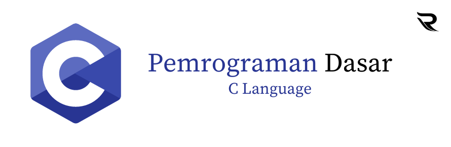

Bahasa pemrograman C adalah salah satu bahasa pemrograman yang paling populer dan penting dalam dunia komputer. Ciptaan oleh Dennis Ritchie pada tahun 1972 di Bell Labs, bahasa pemrograman C memiliki sejarah yang panjang dan digunakan secara luas dalam berbagai bidang pengembangan perangkat lunak. Berikut deskripsi dan penjelasan singkat tentang pemrograman C dan beberapa contoh program yang umum digunakan dalam konteks seperti input/output dan program kasir:

Pemrograman C adalah bahasa pemrograman yang dianggap sebagai bahasa tingkat tinggi dan tingkat menengah. Ini memiliki sintaks yang relatif sederhana dan memungkinkan pengembang untuk mengakses dan mengendalikan sumber daya komputer dengan detail yang tinggi. Bahasa C sangat kuat dalam memanipulasi memori dan pengoptimalan kode.

Terdapat 5 Program diantaranya :
1. Program Input Output Nilai sederhana.
2. Program Penjumlahan, Pengurangan dan Perkalian Matriks 3x3.
3. Program Sederhana Penjumlahan dan Perkalian.
4. Program Konstanta Hitung Berat Sapi.
5. Program Kondisi dan Looping/Perulangan.

Credit by : Rayhan Rizky Widi Ananta - KelasRayhan
Tanggal Update :

29/10/2023 "Dokumentasi Pemrograman C"

